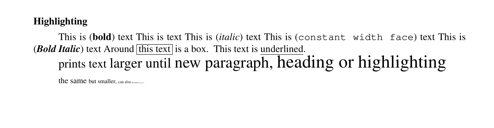

# Groff

## ms

compile with
```sh
groff -ms index.ms -T pdf > index.pdf
```

### Document information
```
.TL
My Title
.AU
Author
.AI
Authors Insitution
```

### Abstract
```
.AB [no]
Place for your abstract [no] option suppresses heading
.AE
```

### Paragraph
```
.PP
This is a paragraph with indention.
.LP
This is a paragraph without indention.
.QP
Creates left and right margin
.XP
First line begins at the left margin (Opposite as PP)
```

### Heading
```
.NH xx
Numbered heading level xx
.SH
unnumbered heading
```

### Highlighting


```
{{#include groff.ms}}
```


